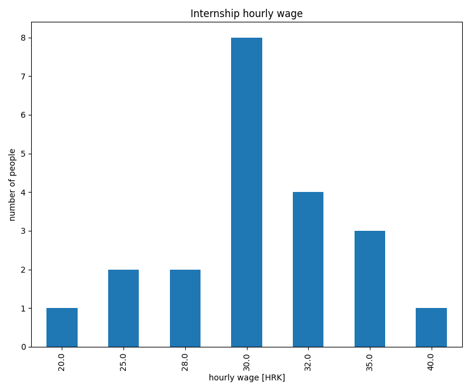
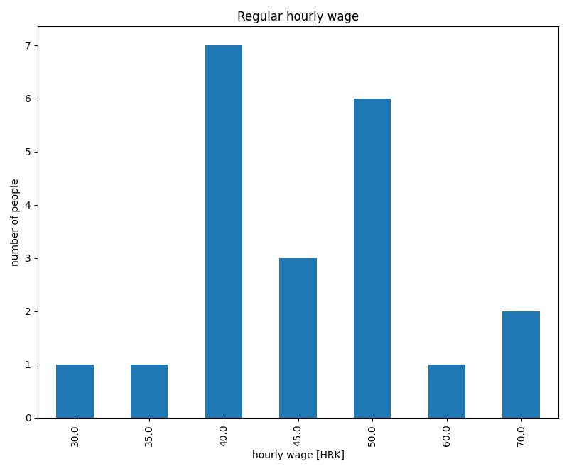

# Student poll

This student poll was made with the intent to get a better insight of student needs and expectations during their internships and employment.

The poll language is croatian.
All students tested have a minimum final grade of B, with most of them having a grade mean > 4.0, have finished at least one internship and have finished either their second or final bachelors year.

See [this google forms url for the poll.](https://docs.google.com/forms/d/e/1FAIpQLSelt9sSKwEIqqG4JofjQkJl9EAeL5sxRzlNUnaqLS2VIYKzjg/viewform?usp=sf_link)

## Poll results

A total of 21 students participated in the poll, which should include everyone that falls within the set constraints.

The collected data is present in the `data/` folder in the form of `*.csv` files.
Both a Croatian and English translation were made.

All graphs were made using the `process.py` script.
Used libraries:
- Pandas
- Matplotlib

Desired internship hourly wage:

| Min [HRK] | Max [HRK] | Mean [HRK] | Median [HRK]  | Standard deviation |
|:---------:|:---------:|:----------:|:-------------:|:------------------:|
|     20    |     40    |    30.7    |       30      |         4.06       |

Desired regular wage:

| Min [HRK] | Max [HRK] | Mean [HRK] | Median [HRK]  | Standard deviation |
|:---------:|:---------:|:----------:|:-------------:|:------------------:|
|     30    |     70    |    45.5    |       45      |        8.87        |

A bigger standard deviation can be observed between the internship and regular hourly wage, this indicates more variance. 
It could be due to some students having more work experience than others and thus higher salary expectations, some students perhaps have no work experience
so they could have given a lower estimate.

One student noted in the internship hourly wage field how just by having a paid internship it gives companies an edge over the others, since a lot of internships are unpaid. 
