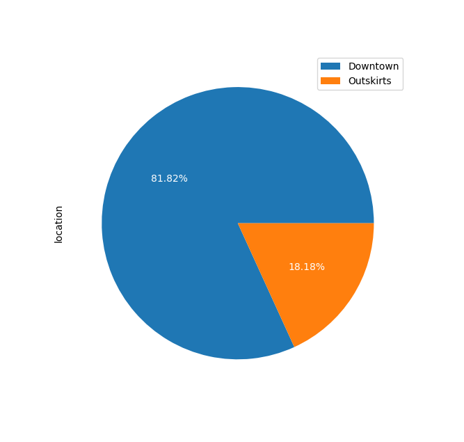

# Student poll

This student poll was made with the intent to get a better insight of student needs and expectations during their internships and employment.

The poll language is Croatian.
All students tested have a minimum final grade of B, with most of them having a grade mean > 4.0, have finished at least one internship and have finished either their second or final bachelors year.

See [this google forms URL for the poll.](https://docs.google.com/forms/d/e/1FAIpQLSelt9sSKwEIqqG4JofjQkJl9EAeL5sxRzlNUnaqLS2VIYKzjg/viewform?usp=sf_link)

## Poll results

A total of 21 students participated in the poll, which should include everyone that falls within the set constraints.

The collected data is present in the `data/` folder in the form of `*.csv` files.
Both a Croatian and English translation were made.

All graphs were made using the `process.py` script.

Python 3.8.2 with the following modules was used:
- Pandas 1.1.2
- Matplotlib 3.3.0

### Desired internship hourly wage

| Min [HRK] | Max [HRK] | Mean [HRK] | Median [HRK]  | Standard deviation |
|:---------:|:---------:|:----------:|:-------------:|:------------------:|
|     20    |     40    |    30.7    |       30      |         4.06       |

### Desired regular hourly wage

| Min [HRK] | Max [HRK] | Mean [HRK] | Median [HRK]  | Standard deviation |
|:---------:|:---------:|:----------:|:-------------:|:------------------:|
|     30    |     70    |    45.5    |       45      |        8.87        |

A bigger standard deviation can be observed in the internship hourly wage relative to the regular hourly wage, this indicates more variance in the regular hourly wage, or in other words a more spread out dataset. 

It could be due to some students having more work experience than others and thus having higher salary expectations, some students perhaps have no work experience, so they could have given a lower estimate, etc.

Internship hourly wages could have a lower standard deviation relative to regular hourly wages since everyone's been through an internship, so they have a firmer grasp over reality.
These are only my subjectively objective insights. :)

Since the mean and median are approximately the same it indicates an even distribution.

One student noted in the internship hourly wage field how just by having a paid internship it gives companies an edge over the others, since a lot of internships are unpaid. 

### Value of services and characteristics of the employer

For this section, each question had an accompanying scoring system attached to it ranging from 0 to 4, indicating the value of the given question or in other words, service/characteristic of the employer.

For ease of visualization each question was shortened to the form of:
- q0 - Wage importance
- q1 - Flexible work times
- q2 - Ability to work from home
- q3 - Being given hardware and peripherals for work
- q4 - Free coffee, juice, fruits, snacks in general
- q5 - Paid/cheaper meals
- q6 - Opportunity to progress and improve one's abilities
- q7 - Use technology as desired, if circumstances allow
- q8 - The influence of the individual, the existence of a competent person who listens to your ideas and requirements
- q9 - Possibility to continue working after completing an internship

### Location preference

### Workspace preference

### Observed shortcomings, difficulties during the cooperation with previous employers
Participant answers:
- "Giving jobs that no one wants to a new employee. In my opinion, it has a bad effect on a person's morale and motivation if he faces an almost impossible problem right after employment."
- "Lack of communication."
- "Lack of mentor’s attention."
- "The employer monitors my work, but asks for corrections on the project when I'm done with it, although he could have told me about certain changes before."
- "Lack of useful materials on the technologies used that we encounter for the first time."
- "Unclear communication. Incomplete and poor quality documentation."

### Is there anything that seems far from reality to you and you think is feasible during an internship/regular work
Participant answers:
- "Would be cool to be able to bring pets to work, although it might complicate the work environment?"
- "The possibility of having a team that would help new workers/students learn and grow within the company."
- "A bigger project."
- "Eliminate unnecessary communication, assign tasks using the same format and detailed execution conditions. (standardization)"

